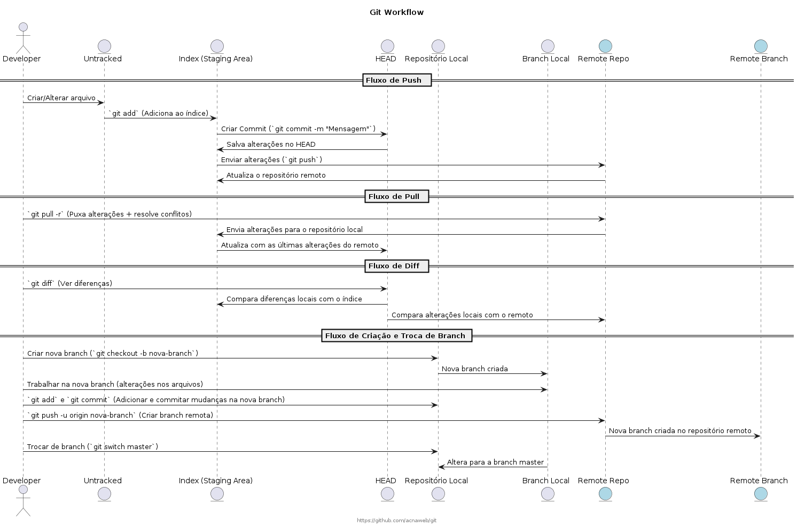

# Git

Este tutorial irá guiá-lo no processo de criação de um repositório no GitHub e uso básico do Git para gerenciamento de código.

## Passo 1: Crie uma Conta no GitHub

1. Vá até o [site do GitHub](https://github.com/).
2. Clique em "Sign up" e siga as instruções para criar sua conta.

## Passo 2: Crie um Novo Repositório

1. Faça login na sua conta do GitHub.
2. No canto superior direito, clique no ícone de "+" e selecione "New repository".
   
   

3. Preencha as informações do repositório:
    - **Repository name**: Nome do seu repositório (ex: `meu-repositorio`).
    - **Description**: (opcional) Adicione uma descrição para o seu repositório.
    - **Public/Private**: Escolha entre público ou privado.
    - **Initialize this repository with**: Selecione para adicionar um README, gitignore ou licença (opcional).

4. Clique em **Create repository** para finalizar.

## Passo 3: Clonando o Repositório no Seu Computador

1. Após criar o repositório, você verá a URL do repositório na parte superior da página. Copie a URL (HTTPS ou SSH).

   Exemplo de URL: `https://github.com/usuario/meu-repositorio.git`

2. Abra seu terminal ou Git Bash e digite o comando para clonar o repositório:

   ```bash
   git clone https://github.com/usuario/meu-repositorio.git

## Git Workflow



## Git Sh